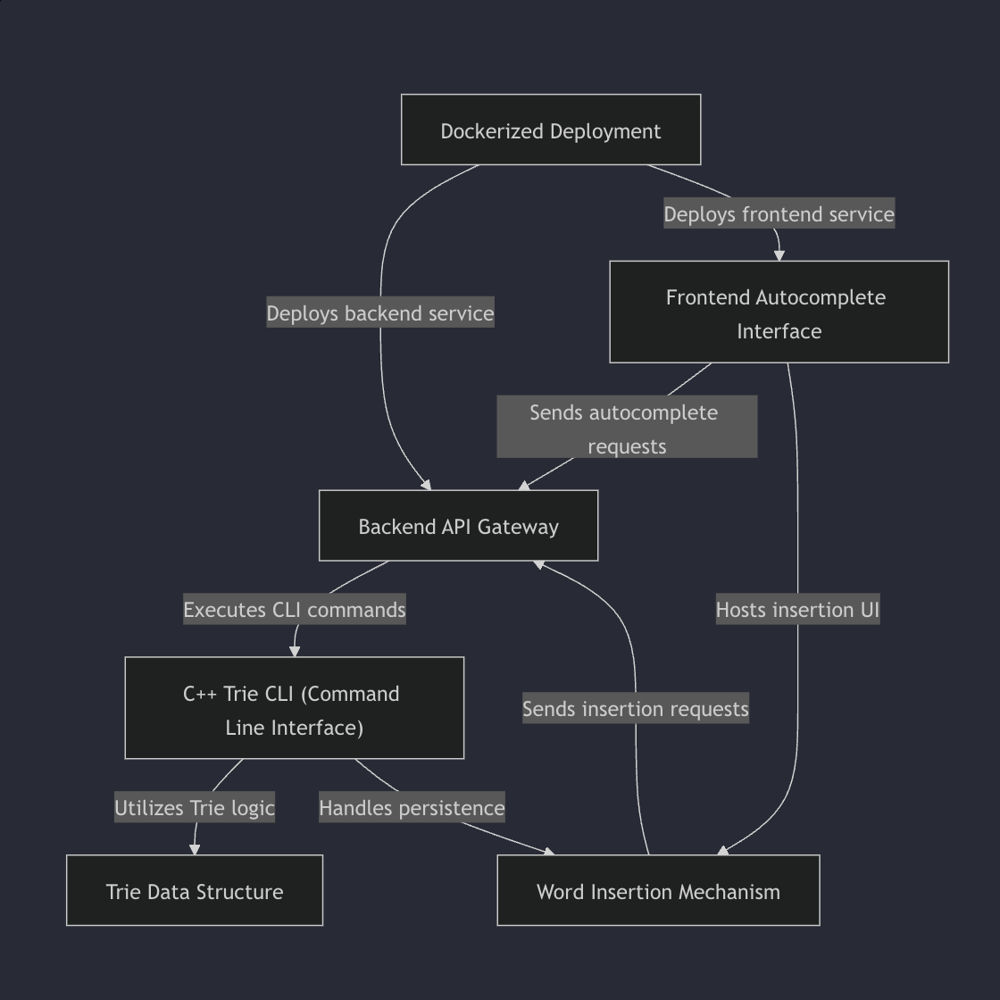
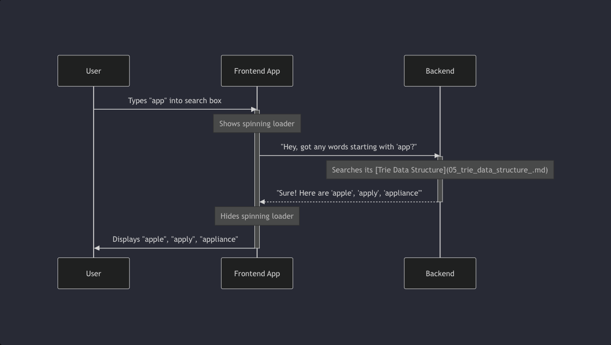

# 🔎 Trie-based Autocomplete System

This project implements an **Autocomplete Engine** using a **C++ Trie Data Structure**, wrapped in a **Dockerized deployment** with a frontend interface. The system allows users to type queries and get instant suggestions, as well as insert new words into the Trie.

---

## ⚡ Features
- ✅ **Trie Data Structure** for fast prefix-based word lookups  
- ✅ **C++ CLI integration** for efficient backend logic  
- ✅ **REST API Gateway** connecting frontend & backend  
- ✅ **Dockerized Deployment** (frontend + backend services)  
- ✅ **Word Insertion Mechanism** with persistence support  
- ✅ **Frontend Autocomplete Interface** with real-time search  

---

## 🏗️ System Architecture

The architecture is designed to keep frontend, backend, and data structure logic modular and maintainable.



**Explanation:**
- **Dockerized Deployment** → Deploys both frontend and backend services  
- **Frontend Autocomplete Interface** → UI for search + word insertion  
- **Backend API Gateway** → Bridges frontend requests with backend Trie logic  
- **C++ Trie CLI** → Executes core Trie operations (search, insert)  
- **Trie Data Structure** → Stores and retrieves words efficiently  
- **Word Insertion Mechanism** → Allows new words to be persisted in the Trie  

---

## 🔄 Request Workflow

Here’s how a typical user query flows through the system:



**Step-by-step:**
1. User types `"app"` in the frontend search box.  
2. Frontend shows a spinning loader and sends request to backend.  
3. Backend queries the **Trie Data Structure** for matches.  
4. Backend responds with suggestions (e.g., `"apple"`, `"apply"`, `"appliance"`).  
5. Frontend hides loader and displays results in real-time.  

---

## 🐳 Deployment

The system is containerized using **Docker**, making it easy to deploy anywhere.  
- **Frontend Service** → Handles user interaction  
- **Backend Service** → Handles API requests, Trie queries, and persistence  

To run the system locally:
```bash
# Build and start services
docker-compose up --build
